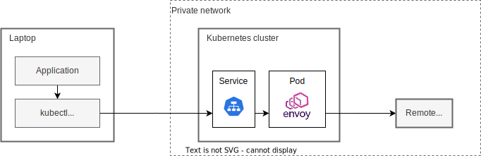

# ktunnels [](https://github.com/int128/ktunnels/actions/workflows/go.yaml)

This is a Kubernetes controller to set up an [Envoy Proxy](https://www.envoyproxy.io) for port-forwarding from your computer to remote hosts.

## Purpose

For local development, it is nice to develop an application using a real database.
If a database is running in a **private network** and outside of a cluster, such as Amazon RDS or Azure Database, it is **unreachable** from your computer.

This allows you to connect from your computer to a host outside of a cluster.
You just run `kubectl port-forward` and set up your application to connect to localhost.



This solution is an alternative of SSH or SOCKS bastion.
You no longer maintain your bastion servers.

## Getting Started

### For administrator

Deploy the controller.

```sh
kubectl apply -f https://github.com/int128/ktunnels/releases/download/v0.1.0/ktunnels.yaml
```

### For user

Create a `Proxy` resource and `Tunnel` resource.

```yaml
# kubectl apply -f proxy.yaml
apiVersion: ktunnels.int128.github.io/v1
kind: Proxy
metadata:
  name: default
spec:
```

```yaml
# kubectl apply -f tunnel.yaml
apiVersion: ktunnels.int128.github.io/v1
kind: Tunnel
metadata:
  name: backend-db
spec:
  host: backend-db.staging
  port: 5432
  proxy:
    name: default
```

Run port-forward on your computer.

```sh
kubectl port-forward svc/backend-db 5432:5432
```

You can connect to the database via `localhost:5432`.

## How it works

This controller sets up a set of `Deployment` and `ConfigMap` for each proxy.

```console
% kubectl tree proxy default
NAMESPACE  NAME                                               READY  REASON  AGE
default    Proxy/default                                      -              5m9s
default    ├─ConfigMap/ktunnels-proxy-default                 -              5m9s
default    └─Deployment/ktunnels-proxy-default                -              5m9s
default      └─ReplicaSet/ktunnels-proxy-default-5db5d68b6c   -              5m9s
default        └─Pod/ktunnels-proxy-default-5db5d68b6c-wnncc  True           5m9s
```

It also sets up a `Service` for each tunnel.

```console
% k tree tunnel main-db
NAMESPACE  NAME                             READY  REASON  AGE
default    Tunnel/main-db                   -              32m
default    └─Service/main-db                -              32m
default      └─EndpointSlice/main-db-cxx65  -              32m
```

## Contributions

This is an open source software licensed under Apache License 2.0.
Feel free to open issues and pull requests for improving code and documents.
